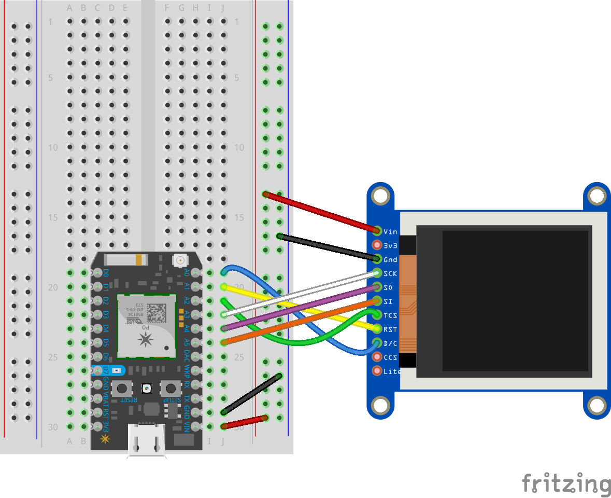

# ST7789 library for Particle Photon

## Usage

  Clone the project and use with VS Code, or start from this version in the Particle Online IDE [https://go.particle.io/shared_apps/5ea074f146180b001641ca26](https://go.particle.io/shared_apps/5ea074f146180b001641ca26)
  
  Requires [https://github.com/pkourany/Adafruit_mfGFX_IDE](https://github.com/pkourany/Adafruit_mfGFX_IDE) to be installed.
  
  
  
## Tested hardware

  Tested with this 135 x 240 pixel display from Adafruit:
  [https://learn.adafruit.com/adafruit-1-14-240x135-color-tft-breakout/pinouts](https://learn.adafruit.com/adafruit-1-14-240x135-color-tft-breakout/pinouts) and also works with [this 240 x 240 pixel](https://www.banggood.com/1_3-Inch-IPS-TFT-LCD-Display-240240-Color-HD-LCD-Screen-3_3V-ST7789-Driver-Module-p-1383404.html) display from Banggood (3.3V only!).

## Origins

The library is a modified version of a library written by Ananev Ilya. This version was forked from [https://github.com/lspoplove/Arduino-ST7789-Library](https://learn.adafruit.com/adafruit-1-14-240x135-color-tft-breakout/pinouts) and used in the awesome DStike project.

## License
None found, but this seems to have started from Adafruit's ST7735 / ST7789 library, so that implies that the original MIT license Adafruit applied should have followed these libraries I based this on. I encourage supporting Adafruit (as they support our community) by buying hardware from them and including the license:

This is a library for several Adafruit displays based on ST77* drivers.

  Works with the Adafruit 1.8" TFT Breakout w/SD card
    ----> http://www.adafruit.com/products/358
  The 1.8" TFT shield
    ----> https://www.adafruit.com/product/802
  The 1.44" TFT breakout
    ----> https://www.adafruit.com/product/2088
  as well as Adafruit raw 1.8" TFT display
    ----> http://www.adafruit.com/products/618
 
Check out the links above for our tutorials and wiring diagrams. These displays use SPI to communicate, 4 or 5 pins are required to interface (RST is optional).

Adafruit invests time and resources providing this open source code, please support Adafruit and open-source hardware by purchasing products from Adafruit!

Written by Limor Fried/Ladyada for Adafruit Industries.
MIT license, all text above must be included in any redistribution.
